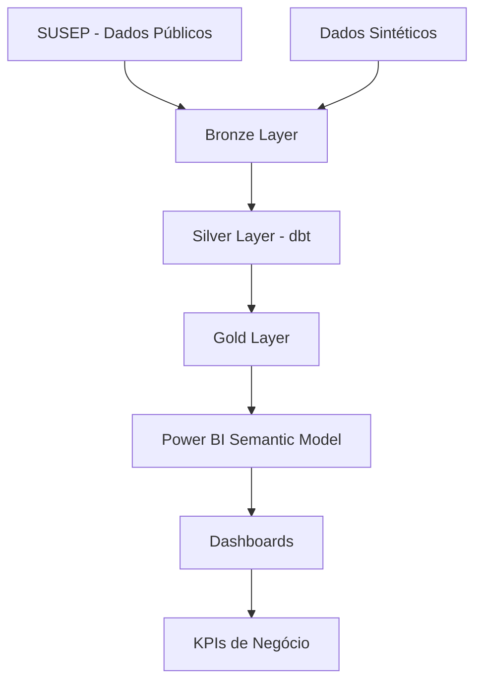

```mermaid
flowchart TD

    A[SUSEP - Dados Públicos]
    B[Dados Sintéticos]

    A --> C[Bronze Layer]
    B --> C

    C --> D[Silver Layer - dbt]

    D --> E[Gold Layer]

    E --> F[Power BI Semantic Model]

    F --> G[Dashboards]

    G --> H[KPIs de Negócio]
```
