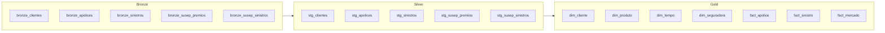

```mermaid
flowchart LR

    subgraph Bronze
        B1[bronze_clientes]
        B2[bronze_apolices]
        B3[bronze_sinistros]
        B4[bronze_susep_premios]
        B5[bronze_susep_sinistros]
    end

    subgraph Silver
        S1[stg_clientes]
        S2[stg_apolices]
        S3[stg_sinistros]
        S4[stg_susep_premios]
        S5[stg_susep_sinistros]
    end

    subgraph Gold
        G1[dim_cliente]
        G2[dim_produto]
        G3[dim_tempo]
        G4[dim_seguradora]

        G5[fact_apolice]
        G6[fact_sinistro]
        G7[fact_mercado]
    end

    Bronze --> Silver
    Silver --> Gold
```
