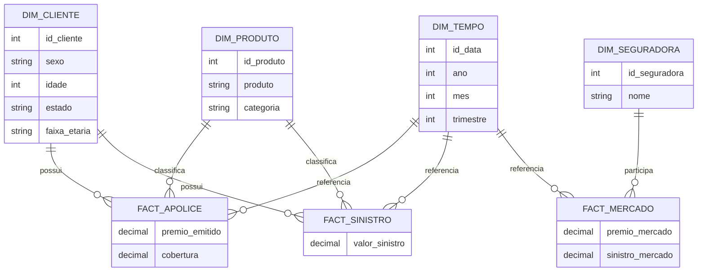

```mermaid
erDiagram

    DIM_CLIENTE ||--o{ FACT_APOLICE : possui
    DIM_PRODUTO ||--o{ FACT_APOLICE : classifica
    DIM_TEMPO ||--o{ FACT_APOLICE : referencia

    DIM_CLIENTE ||--o{ FACT_SINISTRO : possui
    DIM_PRODUTO ||--o{ FACT_SINISTRO : classifica
    DIM_TEMPO ||--o{ FACT_SINISTRO : referencia

    DIM_SEGURADORA ||--o{ FACT_MERCADO : participa
    DIM_TEMPO ||--o{ FACT_MERCADO : referencia

    DIM_CLIENTE {
        int id_cliente
        string sexo
        int idade
        string estado
        string faixa_etaria
    }

    DIM_PRODUTO {
        int id_produto
        string produto
        string categoria
    }

    DIM_TEMPO {
        int id_data
        int ano
        int mes
        int trimestre
    }

    DIM_SEGURADORA {
        int id_seguradora
        string nome
    }

    FACT_APOLICE {
        decimal premio_emitido
        decimal cobertura
    }

    FACT_SINISTRO {
        decimal valor_sinistro
    }

    FACT_MERCADO {
        decimal premio_mercado
        decimal sinistro_mercado
    }
```
