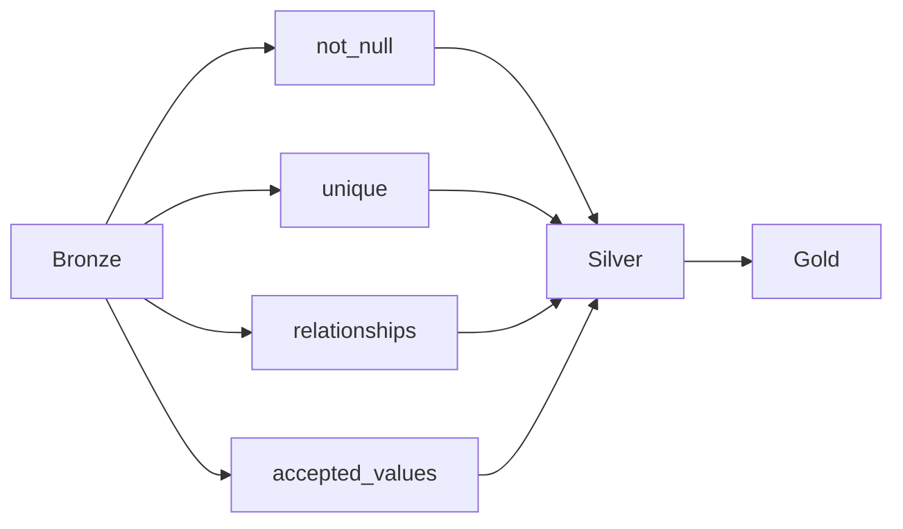

```mermaid
flowchart LR

    A[Bronze]

    A --> B[not_null]
    A --> C[unique]
    A --> D[relationships]
    A --> E[accepted_values]

    B --> F[Silver]
    C --> F
    D --> F
    E --> F

    F --> G[Gold]
```
