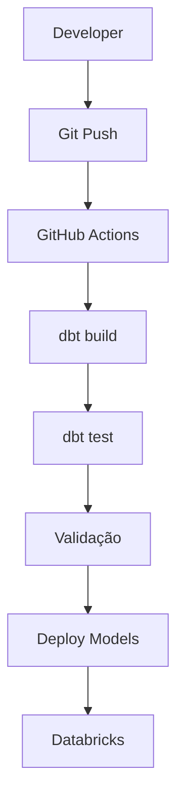

```mermaid
flowchart TD

    A[Developer]

    A --> B[Git Push]

    B --> C[GitHub Actions]

    C --> D[dbt build]

    D --> E[dbt test]

    E --> F[Validação]

    F --> G[Deploy Models]

    G --> H[Databricks]
```
